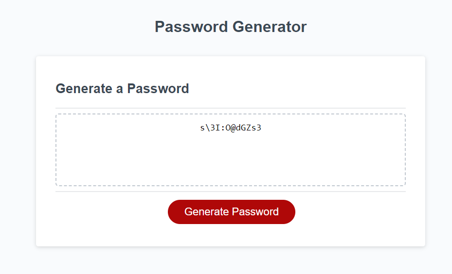

# module-3-challenge

## Description

This week's Challenge requires you to create an application that an employee can use to generate a random password based on criteria they've selected. This app will run in the browser, and will feature dynamically updated HTML and CSS powered by JavaScript code that you write. It will have a clean and polished user interface that is responsive, ensuring that it adapts to multiple screen sizes. This week's coursework will teach you all the skills you need to succeed in this assignment.

## User Story

```
AS AN employee with access to sensitive data
I WANT to randomly generate a password that meets certain criteria
SO THAT I can create a strong password that provides greater security
```

## Acceptance Criteria

```
GIVEN I need a new, secure password
WHEN I click the button to generate a password
THEN I am presented with a series of prompts for password criteria
WHEN prompted for password criteria
THEN I select which criteria to include in the password
WHEN prompted for the length of the password
THEN I choose a length of at least 8 characters and no more than 128 characters
WHEN asked for character types to include in the password
THEN I confirm whether or not to include lowercase, uppercase, numeric, and/or special characters
WHEN I answer each prompt
THEN my input should be validated and at least one character type should be selected
WHEN all prompts are answered
THEN a password is generated that matches the selected criteria
WHEN the password is generated
THEN the password is either displayed in an alert or written to the page
```

## Screenshot



## Deployed URL

TBD

## What was my motivation?

To apply and master the concepts learned on Javascript, including setting variables, creating arrays, creating and running functions, creating windows - prompts, alerts, and confirms - concating, for loops, query selectors, math - floor, random - push, join, within JS to complete desired result.

## Why did I build this project?

To use the building blocks listed above and better understand how they work within js.

## What problem does it solve?

This application solves the problem of creating quick and easy secure passwords.

## What did you learn?

How to apply for loops, how to create an array from character codes, how to define variables in the global and scope level and how it impacts the code, how to join a set of values back to string, check for an event and add a function when the event starts, how to generate and display text to a defined element within HTML.

## What makes your project stand out?

Creating an array from character codes. Re-prompting the writePassword function if the defined criteria is not met.